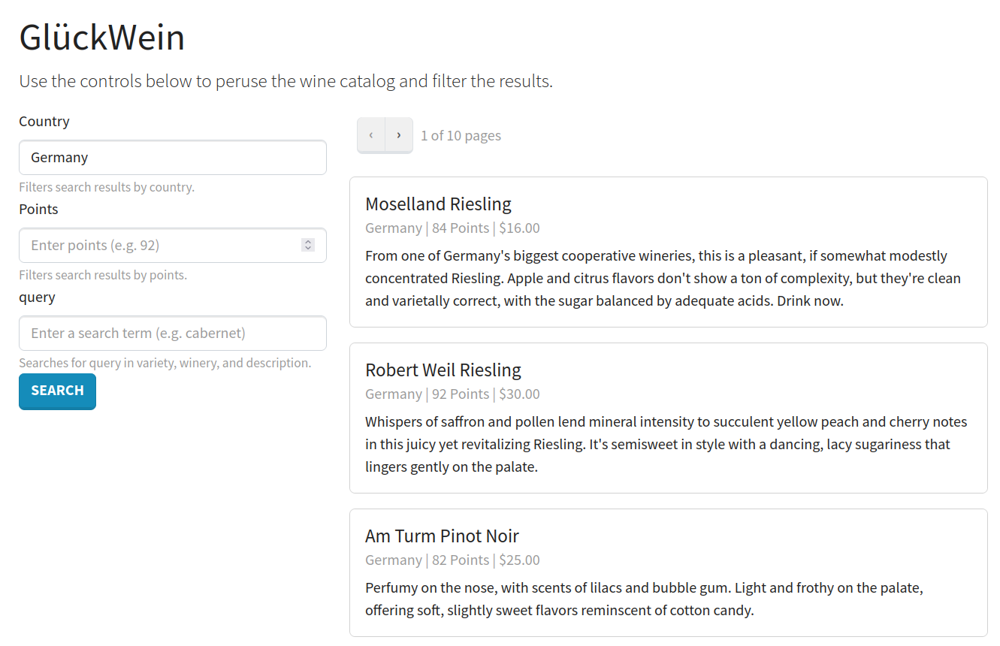

[](https://codecov.io/gh/Weapon-X6/GluEckWein)

# GlückWein
A RESTful API for wines using Full-Text Search


### Features

* Supports pagination, filtering, ranking, and highlighting
* Also offer suggestions for misspelled words 
* Provides a Postgres API along with a more advanced Elasticsearch API
* React client use E2E testing (Cypress)

### Up & Running
Just run
```
docker-compose up -d --build
```

Then you can use it through the React client at http://localhost:3000/




You can also use the API directly either using:
- Elasticsearch through http://localhost:8003/api/v1/catalog/wines/  or
- Postgres through http://localhost:8003/api/v1/catalog/pg-wines/
